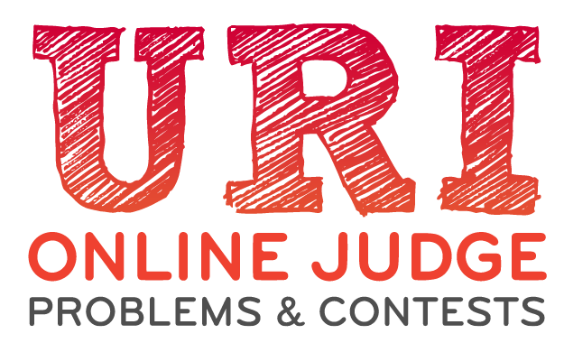

  

<h2 align="center">The main goal of URI is to provide programming practice and knowledge sharing</h2>

<h3 align="center">Their platform contains more than 2000 problems divided in 9 categories, here are some solutions that I developed</h3>

 

  

  

  

  

  

  

 
 

# :books: Graph Theory

 - [Adjacency List - Graph Representation](./algorithms/graphs/adjacency_list.cpp)
 - [Depth-First Search](./algorithms/graphs/dfs.cpp)
 - [Breadth-First Search](./algorithms/graphs/bfs.cpp)
 - [Union-Find | Disjoint-Set](./algorithms/graphs/union_find.cpp)
 - [Kruskal](./algorithms/graphs/kruskal.cpp)
 - [Dijkstra](./algorithms/graphs/dijkstra.cpp)
 - [Floyd Warshall](./algorithms/graphs/floyd_warshall_path.py)

 

# :thought_balloon: Math

- [Euclides](./algorithms/math/euclides.cpp)

 

# :mag: Search

 - [Binary Search](./algorithms/search/binary_search.cpp)

 

# :floppy_disk: Other

 - [Kadane](./algorithms/other/kadane.cpp)

 

# :postbox: Contact

Made by **Gabriel Bonizário** 👋🏻

**Linkedin**: [gabriel-bonizario](https://www.linkedin.com/in/gabriel-bonizario/)

---
